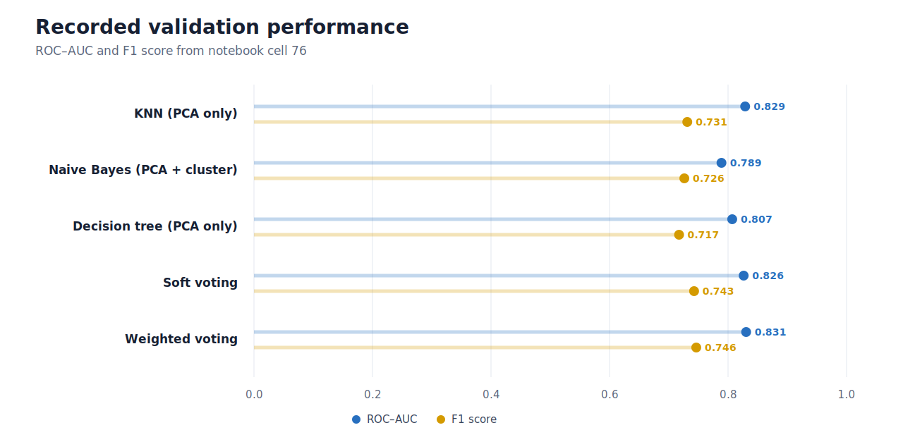
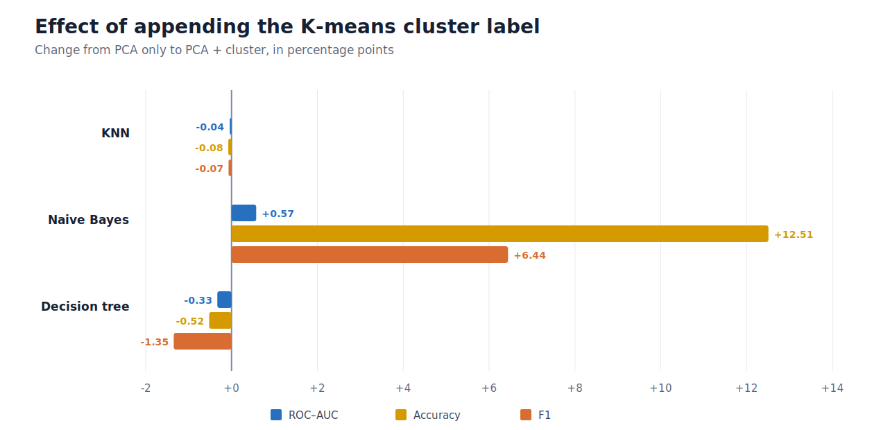
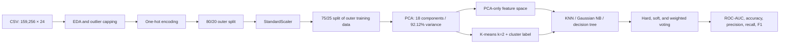

# Smoking Status Classification from Bio-signals

[](https://www.python.org/)
[](Project.ipynb)
[](requirements.txt)
[](LICENSE)

A methodological case study of binary **smoker-status classification** from tabular demographic, physical-examination, and biochemical measurements. One executed notebook compares preprocessing, PCA, K-means feature augmentation, three base classifiers, and voting ensembles.

> **Scope correction:** despite the repository's legacy name, the target is current smoking status (`smoking = 1`) rather than cessation, quit success, relapse, or treatment response. The study therefore does **not** evaluate smoking-cessation detection.

## Technical summary

- The notebook records **159,256 observations and 24 columns**: an identifier, the binary target, and 22 candidate predictors. It reports no missing values or duplicate rows.
- The effective split is 60% training (95,553 rows), 20% validation (31,851), and 20% test (31,852), using `random_state=42` without stratification.
- Eighteen principal components retain **92.12%** of the variance in the notebook output. A two-cluster K-means label is then tested as one additional feature.
- In the final validation table, weighted soft voting records the highest ROC-AUC (**0.8305**) and F1 (**0.7464**); KNN records the highest accuracy (**0.7509**) and precision (**0.6889**); soft voting records the highest recall (**0.9010**).
- Cluster augmentation materially improves the recorded Gaussian Naive Bayes accuracy and F1, but does not improve KNN or the decision tree.
- **Validation assessment: needs revision before scientific or clinical use.** Pre-split transformations, test-informed model selection, reuse of the validation set, and an ensemble feature-space inconsistency make the small ranking differences optimistic and not statistically established.

## Recorded model comparison

These are the values saved by notebook cell 76 on the 31,851-row validation partition. They are descriptive reproductions of the notebook output—not independently replicated estimates or evidence of clinical utility.

| Model | Evaluation input | ROC-AUC | Accuracy | Precision | Recall | F1 |
|---|---|---:|---:|---:|---:|---:|
| KNN (`k=21`) | PCA only | 0.828881 | **0.750871** | **0.688944** | 0.778997 | 0.731208 |
| Gaussian Naive Bayes | PCA + cluster | 0.788912 | 0.704719 | 0.608537 | 0.900397 | 0.726241 |
| Decision tree | PCA only | 0.807036 | 0.734168 | 0.667329 | 0.775460 | 0.717343 |
| Soft voting | PCA supplied to all cloned estimators | 0.826390 | 0.728423 | 0.631699 | **0.900974** | 0.742682 |
| Weighted soft voting | PCA supplied to all cloned estimators | **0.830536** | 0.741327 | 0.650741 | 0.874919 | **0.746360** |



The leading ROC-AUC exceeds KNN by only 0.0017, and the leading F1 exceeds soft voting by 0.0037. No confidence intervals, repeated splits, or paired significance tests are reported, so these gaps should not be interpreted as conclusive superiority.

## What did clustering add?

Cells 55, 58, and 64 compare PCA-only and PCA-plus-cluster variants on the 31,852-row test partition.

| Classifier | PCA-only ROC-AUC | PCA + cluster ROC-AUC | Δ ROC-AUC | Δ accuracy | Δ F1 | Recorded effect |
|---|---:|---:|---:|---:|---:|---|
| KNN | 0.829660 | 0.829243 | −0.000417 | −0.000754 | −0.000695 | No improvement |
| Gaussian Naive Bayes | 0.787499 | 0.793245 | +0.005746 | +0.125078 | +0.064411 | Large accuracy/F1 gain |
| Decision tree | 0.809182 | 0.805870 | −0.003312 | −0.005212 | −0.013466 | Performance declines |



The cluster label helps only Naive Bayes in these recorded results. Its silhouette score is approximately 0.16, indicating weak separation. The notebook text also says the Davies–Bouldin index is lowest at 10 clusters while later claiming that all three selection criteria support two clusters; that internal contradiction should be resolved by reporting the numeric clustering table.

## Experimental pipeline



### Methods at a glance

| Stage | Notebook implementation | Comparison purpose |
|---|---|---|
| Outlier treatment | Domain caps, IQR caps, and fixed-range caps | Reduce the influence of extreme measurements |
| Categorical encoding | One-hot encoding with first level dropped | Represent hearing, urine-protein, and dental-caries categories |
| Scaling | `StandardScaler` | Put variables on comparable scales before PCA/KNN |
| LDA diagnostic | One supervised component | Inspect whether a one-dimensional supervised projection separates classes |
| PCA | Fixed at 18 components after variance inspection | Reduce collinearity and dimensionality |
| Cluster augmentation | K-means with `k=2` | Test whether an unsupervised group label adds predictive information |
| KNN selection | Odd `k` values 1–25, five-fold ROC-AUC | Select neighborhood size; notebook fixes `k=21` |
| Decision-tree tuning | Grid search, three-fold ROC-AUC | Select depth, split, leaf, and feature parameters |
| Ensembles | Hard, soft, and weighted voting (`2:1:1.5`) | Compare majority and probability aggregation |

## Data and outcome definition

The notebook output records a `(159256, 24)` table and drops `id` and `smoking` to form the predictors. Its row count and columns align with the [Kaggle Playground Series S3E24 competition data](https://www.kaggle.com/competitions/playground-series-s3e24/data), while the earlier README cited the separate [Smoker Status Prediction using Bio-Signals dataset page](https://www.kaggle.com/datasets/gauravduttakiit/smoker-status-prediction-using-biosignals).

Because the raw CSV and a checksum are not committed, this repository cannot conclusively establish which download/version produced the saved outputs. Confirm provenance and source terms before publishing or extending the study.

| Group | Variables |
|---|---|
| Demographic/anthropometric | Age, height, weight, waist circumference |
| Sensory | Left/right eyesight and hearing |
| Cardiovascular/metabolic | Systolic/diastolic pressure, fasting glucose, cholesterol, triglycerides, HDL, LDL |
| Liver/kidney/hematology | AST, ALT, GTP, serum creatinine, hemoglobin, urine protein |
| Other | Dental caries |
| Outcome | `smoking`: 1 = smoker, 0 = non-smoker |

## Reproducibility

### 1. Create an environment

```bash
git clone https://github.com/goutham-1902/Methodological-Comparison-on-Binary-Classification-for-Smoking-Cessation-Detection-.git
cd Methodological-Comparison-on-Binary-Classification-for-Smoking-Cessation-Detection-

python3.11 -m venv .venv
source .venv/bin/activate       # Windows: .venv\Scripts\activate
python -m pip install --upgrade pip
pip install -r requirements.txt
```

### 2. Supply the data

Download the appropriate training CSV from Kaggle and save it as:

```text
data/train.csv
```

Alternatively, point the notebook to an external copy without editing it:

```bash
export SMOKING_DATA_PATH=/absolute/path/to/train.csv
```

The data are ignored by Git and are not distributed under this repository's software license.

### 3. Execute the notebook

```bash
jupyter lab Project.ipynb
```

Use **Restart Kernel and Run All Cells**. Verify that the input shape and columns match the recorded study before comparing new results. The notebook was last saved with Python 3.11.10; package versions are pinned in `requirements.txt`.

### 4. Regenerate README figures

```bash
python scripts/generate_readme_figures.py
```

The figure script uses only Python's standard library, parses the metric tables saved in notebook cells 55, 58, 64, and 76, and writes GitHub-compatible SVGs. Rerun it after executing or correcting the experiment.

## Methodological limitations and required corrections

1. **The study predicts smoking status, not cessation.** A cessation study requires a longitudinal quit/relapse endpoint and an explicit follow-up window.
2. **Outlier limits and category encoding are derived before the first split.** Fit all data-dependent preprocessing inside a pipeline using training folds only.
3. **Validation leakage occurs during scaling.** `StandardScaler` is fitted on the outer training set before that set is divided into the final training and validation partitions.
4. **Feature-selection intent is not executed.** `waist(cm)` and `LDL` are placed in `x_dropped`, but subsequent splitting uses `x`, so both variables remain in the model inputs.
5. **The test partition influences model choice.** PCA-only versus cluster-augmented variants are compared on `Y_test` before the final model set is chosen; reserve the test set for one final evaluation.
6. **Ensemble inputs are inconsistent with their labels.** `VotingClassifier.fit(x_train_pca, ...)` clones and refits every estimator on PCA-only inputs, including the estimator named “Naive Bayes (PCA + Clustered).” A mixed-feature ensemble needs separate preprocessing pipelines or stacked out-of-fold probabilities.
7. **Hard-voting ROC-AUC is not directly comparable.** It is computed from hard class predictions, whereas soft models use continuous probabilities.
8. **Validation is incomplete.** The notebook provides one random split, no class-stratification argument, no uncertainty intervals, no probability calibration, no subgroup analysis, and no external validation.
9. **No deployable model is saved.** The narrative mentions pickling, but no serialization cell or model artifact is present.

These issues do not invalidate the notebook as an educational exploration, but they prevent the current ranking from supporting a clinical or deployment claim.

## Recommended next experiment

- Define the task as smoker-status classification or replace the dataset with a longitudinal cessation cohort.
- Implement a `Pipeline`/`ColumnTransformer` so capping, encoding, scaling, PCA, and modeling are fitted inside stratified cross-validation folds.
- Use nested cross-validation for model/hyperparameter selection and retain an untouched, stratified test set.
- Compare PCA-only and PCA-plus-cluster variants with paired fold-level estimates and confidence intervals.
- Use separate base-model pipelines in a soft-voting or stacking ensemble; generate meta-features out of fold.
- Report sensitivity, specificity, PR-AUC, calibration, decision thresholds, and subgroup performance in addition to ROC-AUC.
- Add data/model cards, input-schema validation, and a reproducible export only after the evaluation design is corrected.

## Repository structure

```text
.
├── Project.ipynb                    # Executed end-to-end methodological study
├── requirements.txt                 # Pinned Python environment
├── assets/                          # README comparison figures
├── scripts/generate_readme_figures.py
├── data/.gitkeep                    # Local CSV location; contents ignored
├── CITATION.cff
└── LICENSE
```

## Citation

Use the repository's [`CITATION.cff`](CITATION.cff) metadata or cite the specific commit used for analysis. Dataset attribution must be added separately after provenance is confirmed.

## License and responsible use

The source code and documentation are released under the [MIT License](LICENSE). The dataset is not included and remains subject to its source license and terms. This is an educational machine-learning case study, not a medical device, diagnostic system, or substitute for clinical judgment.

## Author

Goutham SDS Kodali — [connect on LinkedIn](https://www.linkedin.com/in/sds-kodali/).
